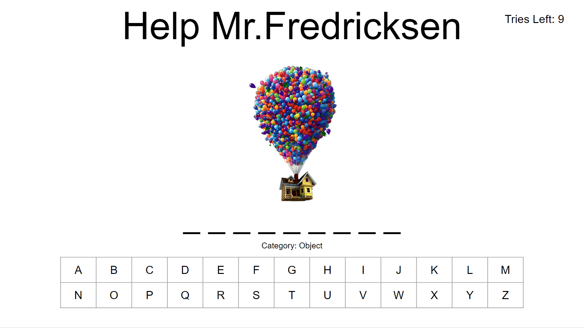

## Project Description

A game where the obect is for one player to guess the letters of an unknown word or phrase before a figure is fully drawn from incorrect answer. Each incorrect answer draws one part of the figure with a total of 10 tries. Guessing the unknown word or phase before all 10 tries is a guaranteed win.

## Wire Frames

## User Stories

### MVP Goals

As a user, I want a browser-based interface so that I can play the game.
As a user, I want the ability to restart the game.
As a user, I want the ability to start new game.
As a user, I want 2 win conditions, Win, Lose.
As a user, I want to track how many tries I have left.
As a user, I want the game to display what letters are left to be picked.
As a user, I want the game to display the body being drawn on.
As a user, I want tht game to display what category the word is.

### Stretch Goals

#### Bronze

As a user, I want the ability to pick a category of what the word will be.
As a user, I want a hint option.
As a user, I want the game to display an module that shows I've won or lost.

#### Silver

As a user, I want to have achievements.
As a user, I want the ability to change background.
As a user, I want the ability to change my font.

#### Gold

As a user, I want multiple difficulty levels: Easy - not timed, Medium - timed, Hard - timed and half body built.
As a user, I want to be able to play on tablet/mobile device.
As a user, I want the ability to change/pick my avatar.
As a user, I want a leaderboard that compares my stats with others.
As a user, I want the ability to change the 'spaceman' being drawn.
